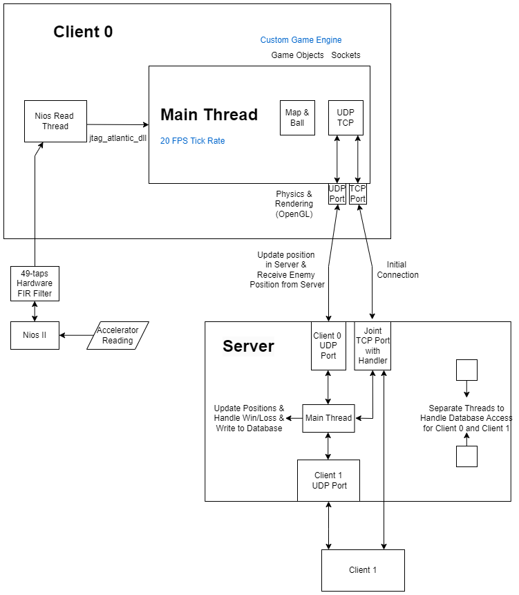

## Full System Architecture

  
   
  <em>Fig 1.1: Full System Architecture Diagram</em>

The system architecture, as shown in Fig 1.1, depicts interactions between two clients, each controlling a ball in the game through a DE10-Lite board. The accelerometer on the board sends data to the Nios II processor, which then filters the data using a 49-taps hardware FIR filter on the board. This filtered data guides the motion of the ball in our fully custom game engine, running at a 20 FPS tick rate, handling physics; as well as rendering via OpenGL.

Communication occurs via both UDP and TCP connections. TCP ensures secure initial connection setup, while UDP provides low-latency updates for game data.

On the server, the main thread receives UDP data from clients, updating player positions, processing game logic, and writing position data to a database. Separate threads handle database access for each client to maintain responsiveness. The main thread synchronizes data between clients for multiplayer functionality. 
